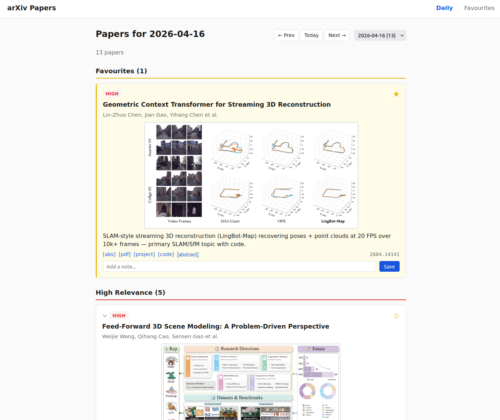

# arxiv-filter

A personal daily arXiv paper filter. I used to manually read arXiv titles, then abstracts, and file away papers through various rough means (printing, Trello) for years. Originally I read the cv and ml lists, but eventually dropped doing both. This tool is just to cut that friction down and triage things for me. Now the signal-to-noise is higher and the UX is much better. It fetches papers from arXiv RSS (`cs.CV` by default), runs them through a two-stage Claude filter based on research interests, and serves the results in a lightweight web UI. I can favourite easily and come back to things, and it scrapes out code, an image, project page etc. when it can.



## How it works

1. **Fetch** - pulls today's cs.CV paper IDs from the arXiv RSS feed, then fetches full metadata (title, abstract, authors) via the arXiv API.
2. **Stage 1 (title scan)** - sends all titles to Claude in batches of ~200. Claude returns candidate IDs worth reading the abstract for, based on your filter criteria.
3. **Stage 2 (abstract filter)** - sends candidate abstracts + your criteria to Claude in parallel batches. Each paper gets a relevance tier (high/moderate) and a one-line summary.
4. **Ingest** - accepted papers are inserted into a SQLite database. Thumbnails are fetched from project pages or arXiv HTML.
5. **Serve** - a Flask app serves the papers grouped by date, with favouriting, dismiss/fold, notes, and LaTeX rendering.

## Project structure

```
arxiv-filter/
  filter_criteria.md      # Your filtering criteria - edit this (see below)
  requirements.txt        # Python dependencies
  scripts/
    cron_update.py        # Main pipeline: fetch -> filter -> ingest (run daily via cron)
    cron_update.sh        # Cron wrapper (sets PATH, activates venv)
    fetch_arxiv_cv.py     # arXiv RSS + API fetcher (standalone CLI too)
    backup_db.sh          # Daily DB backup script
    arxiv-app.service     # systemd user service unit
  app/
    arxiv_app.py          # Flask web app
    models.py             # SQLite schema + queries
    fetch_thumbnails.py   # Thumbnail scraper (project pages, arXiv HTML fallback)
    templates/            # Jinja2 templates (Alpine.js for interactivity)
    static/
      style.css
      alpine.min.js
      thumbs/             # Downloaded paper thumbnails (gitignored)
    data/
      arxiv.db            # SQLite database (gitignored, created on first run)
```

## Setup

### Prerequisites

- Python 3.10+
- [Claude CLI](https://docs.anthropic.com/en/docs/claude-code) installed and authenticated (`claude /login`)

### Install

```bash
git clone https://github.com/reynoldscem/arxiv-filter.git
cd arxiv-filter
python3 -m venv .venv
source .venv/bin/activate
pip install -r requirements.txt
```

### Configure

**1. Edit `filter_criteria.md`** - this is the only file you *need* to change. Describe your research interests, what topics are high/moderate/low priority, and what to exclude. Claude reads this verbatim during filtering.

**2. Update paths in scripts** - the following files have hardcoded paths you'll need to change to match your setup:

| File | What to change |
|---|---|
| `scripts/cron_update.py` | `CLAUDE` - path to your Claude CLI binary |
| `scripts/cron_update.sh` | `PATH` and venv python path |
| `scripts/backup_db.sh` | `DB` and `BACKUP_DIR` paths |
| `scripts/arxiv-app.service` | `WorkingDirectory` and `ExecStart` paths |

**3. (Optional) Change the arXiv category** - defaults to `cs.CV`. Edit the RSS/API calls in `scripts/fetch_arxiv_cv.py` and `scripts/cron_update.py` if you want a different category.

### Run manually

```bash
# Fetch + filter + ingest today's papers
python3 scripts/cron_update.py

# Fetch a specific date
python3 scripts/cron_update.py 2026-01-15

# Start the web app (default: port 5713)
cd app && python3 arxiv_app.py
```

### Run as a service (systemd)

```bash
# Copy and edit the service file
cp scripts/arxiv-app.service ~/.config/systemd/user/
# Edit paths in the service file to match your setup
systemctl --user daemon-reload
systemctl --user enable --now arxiv-app

# Enable lingering so it runs without an active login session
loginctl enable-linger $USER
```

### Cron schedule

Add to your crontab (`crontab -e`):

```cron
# Main daily run (after arXiv RSS updates, ~04:00 local)
0 4 * * * /path/to/scripts/cron_update.sh >> /path/to/cron.log 2>&1

# Weekday catch-up runs (RSS can be stale at 04:00)
0 7 * * 1-5 /path/to/scripts/cron_update.sh >> /path/to/cron.log 2>&1
0 12 * * 1-5 /path/to/scripts/cron_update.sh >> /path/to/cron.log 2>&1
```

The pipeline is idempotent - re-running for the same date won't duplicate papers.

## Customising filter criteria

`filter_criteria.md` is passed directly to Claude as context. Structure it however you like - the example includes:

- **Company/research context** - a one-liner so Claude understands your perspective
- **Quality signals** - code availability, top labs, major venues
- **Primary topics** - high relevance, always include
- **Secondary topics** - moderate relevance, include if notable
- **Exclusions** - topics to always skip

Be specific about what matters to you. "3D reconstruction" is broad; "monocular depth estimation for indoor scenes" tells Claude exactly what to look for.

## Notes

- **arXiv timing**: RSS updates Sun-Thu around 20:00 ET. A 04:00 BST cron may get stale data - the built-in weekday retry (30-min intervals, 3 attempts) handles this, and extra cron runs help.
- **Monday batches**: Weekends accumulate 500+ papers. Stage 1 splits these into parallel batches automatically.
- **Claude rate limits**: The pipeline uses `backoff` for exponential retries. If you hit session limits (429), the extra cron runs will catch up later.
- **Claude auth**: The CLI auth can expire. If you see 401 errors in the cron log, run `claude /login` manually.
- **Thumbnails**: Scraped from project pages and arXiv HTML as a fallback. Saved locally to `app/static/thumbs/` so they survive if the source goes down.

## Built with

Vibe-coded with [Claude Code](https://claude.ai/code).

## License

MIT
